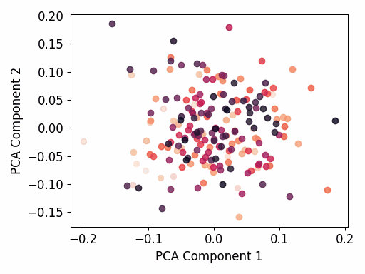
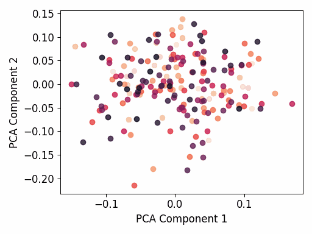
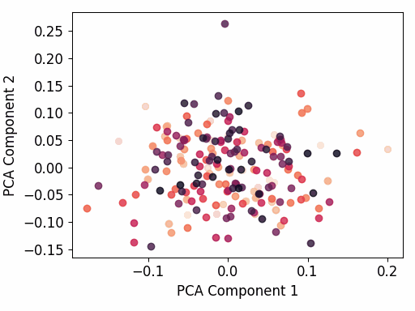
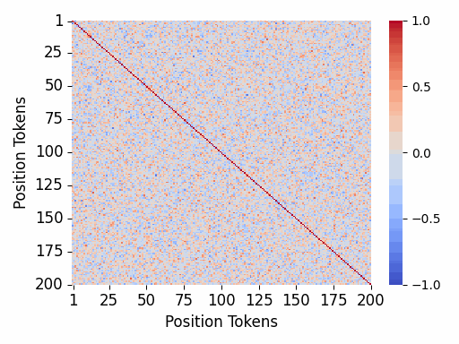
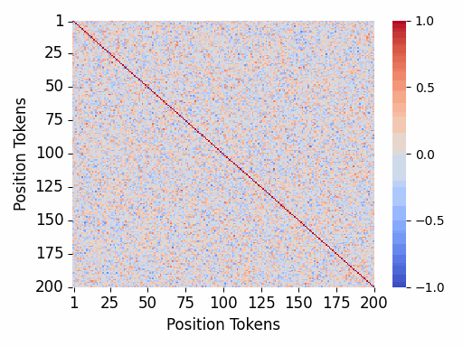
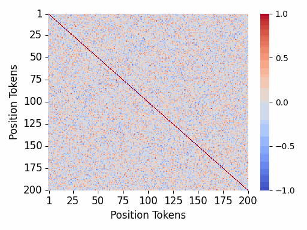

# Retrievit: In-context Retrieval Capabilities of Transformers, State Space Models, and Hybrid Architectures
[[Paper](https://arxiv.org/pdf/2409.05395)][[Model Configs](#models)][[Training](#training)]

## Installation

```
conda create -p retrievit python=3.10

# Install dependencies
poetry install

# Install flash attention / mamba
poe install-flash-attn
poe install-mamba-conv1d
```

## Models
All model configurations are provided under `configs`. 

`hybrid_2M1T_state16.json` refers to a hybrid interleaved model with 1 Transformer block after 2
Mamba blocks. Similarly, `hybrid_2Mamba1T_state16.json` is a model with 1 Transformer block after 2
Mamba2 blocks. All models are configured so that they have roughly the same number of parameters
(see details in the paper).


## Training
All training scripts required to reproduce the results of the paper are under `scripts`

An example of training a Transformer (RoPE) model on the ngram task:
```
./scripts/train_transformer_ngram.sh configs/model/transformer.json 1e-5 128 64 1 False 12345
```

The positional arguments are:
1. Path to model configuration file
2. Learning rate
3. Per device train batch size
4. Per device eval batch size (also used during testing)
5. Boolean value that depicts whether it is a prefix variant (Set to True for prefix)
6. Random seed for sampling/weight initialization


Additional useful arguments that can be set in `train.py` and included in the scripts:
```
# The teacher-forcing accuracy threshold used during evaluation to terminate early, must be betwene 0,1
--early_stopping_threshold 0.95
# Uploads only the embeddings of a model after training to a remote HF repo
--upload_embeddings_after_training True
# Uploads only the embeddings of a model during training to a remote HF repo
--upload_embeddings_during_training True
# Uploads the entire model after training to a remote HF repo
--upload_full_model_after_training True
# The remote HF repo id
--hf_repo_id username/repo_id 
```

## Visualize Embeddings
Assuming you trained a model and you saved the embeddings to a remote HF repo. You can visualize
the learned embeddings for the position retrieval task:

```
python visualize_embeddings.py \
	--hf-repo-id /remote/hf/repo/id \
	--hf-remote-folder /path/to/remote/hf/folder/in/repo \
	--plots-directory /path/to/output/plots/directory \
```


### Examples

#### PCA 2D
|           Transformer (RoPE)           |              Mamba2               |        Hybrid 1 Mamba2/1 Transformer        |
| :------------------------------------: | :-------------------------------: | :-----------------------------------------: |
|  |  |  |


#### Cosine similarities
|           Transformer (RoPE)           |              Mamba2               |            Hybrid 1 Mamba2/1 Transformer            |
| :------------------------------------: | :-------------------------------: | :-------------------------------------------------: |
|  |  |  |